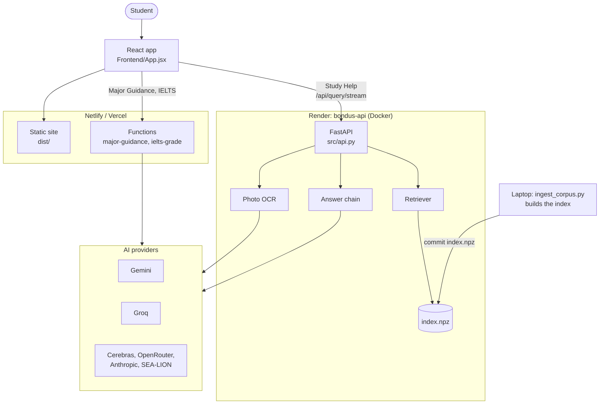
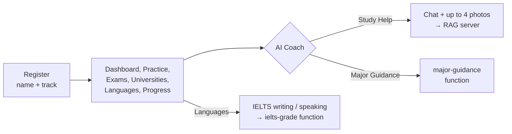
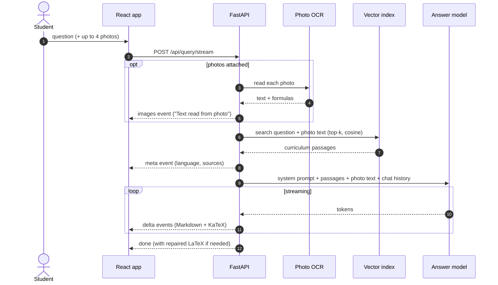
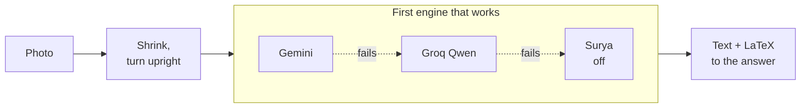
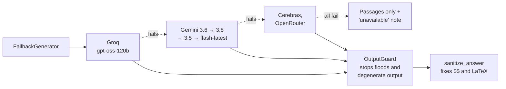
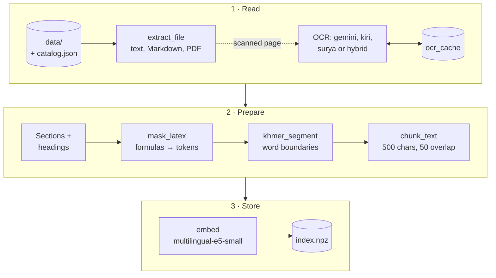

# EduAI Cambodia — Frontend Prototype

AI-powered learning platform for Cambodian students (Grade 9 / BAC II, university
entrance, language tests). React + Vite + Tailwind v4 frontend, plus a local
FastAPI RAG server that powers the **AI Coach** (Study Help) with answers grounded
in the Grade 12 math curriculum, in Khmer or English, with LaTeX formulas.

The frontend still runs on its own: without the server, the coach falls back to
its scripted demo replies.

## Requirements

- Node.js 20.19+ or 22.12+ (check with `node -v`) — get it at https://nodejs.org
- npm (ships with Node)

## Run it locally

```bash
npm install      # first time only
npm run dev      # start the dev server
```

Open the URL it prints (usually http://localhost:5173). You'll start on the
**registration page** — enter a name, pick **Science** or **Social Science**, and
your personalized dashboard is generated.

Other commands:

```bash
npm run build    # production build into dist/
npm run preview  # preview the production build
```

## Science / Social Science tracks

Registration sets the academic track, which decides every subject shown across the
app (`FIELD_SUBJECTS` in `Frontend/App.jsx`):

- **Science:** Mathematics, Physics, Chemistry, Biology, Khmer Literature, History, English, French
- **Social Science:** Khmer Literature, History, Geography, Morality, Earth Science, Mathematics, English, French

Subject mastery, weak/strong tags, the daily plan, recommended lesson, browse
papers, practice sets, and the study coach all filter to the chosen track. To
extend the curriculum, edit `FIELD_SUBJECTS`, `DEFAULT_MASTERY`, and `TOPICS` at
the top of `Frontend/App.jsx`.

## What's in the prototype

- **Registration** with track selection (Science vs Social Science)
- **Dashboard:** daily plan, grade prediction, streak, XP, level, study hours,
  subject mastery, weak/strong subjects, AI recommendations, recommended lesson,
  weekly & monthly goals, recent activity, and an **AI Learning Analytics** panel
- **Practice:** pick a subject → solve exercises that are auto-corrected with an
  explanation and the formula to use; mark each Pending / In progress / Completed,
  which feeds the dashboard's "today" stats, recent activity, and analytics
- **Browse exams, Universities** (click a school for its published sets & common
  exercises), **Languages, Progress** views
- **AI coach** — a Claude/ChatGPT-style chat. *Study Help* streams answers from
  the RAG server (`/api/query/stream`) with Markdown + KaTeX math, interactive
  GeoGebra graphs, sources and a copy button. Attach up to 4 photos of a problem
  (the **+** button, paste, or drag and drop) and ask about them; **+ → Add to
  study library** uploads a PDF / notes / scan to `/api/ingest`. Enter sends,
  Shift+Enter adds a line, and the stop button cancels an answer. *Major Guidance*
  uses the Vercel function in `api/major-guidance.js`
- Light/dark mode, fully responsive (sidebar collapses to a drawer on mobile)

Profile data lives in the browser for the session. Coach questions and uploads go
to the RAG server you run.

## How it works

Six small diagrams, from the whole system down to each step. GitHub draws them
from the Mermaid source below.

### 1. System overview



The site and the API are hosted apart: the Python server (PyTorch and the
embedding model) is too big for Netlify or Vercel functions. On Render the
server is read-only (`ALLOW_WRITES=false`): the index is built on the laptop,
committed, and baked into the Docker image. The functions call Gemini
`flash-latest` first and Groq if it fails (`api/_ai.js`).

### 2. In the app



### 3. Asking the AI Coach a question



The answer comes back in Khmer or English, matching the question; the chat
renders it with KaTeX formulas and GeoGebra graphs.

### 4. Reading a photo



Engines come from `IMAGE_OCR_ENGINES` (`gemini,groq` on Render); a reading
in Chinese is dropped for the next engine, a looping one is trimmed, and
readings are cached by image. Kiri (local Khmer OCR) and Surya are in the image
but off on the 2 GB instance. Compare engines on a photo with
`uv run python scripts/try_image_ocr.py photo.jpg --engines gemini,groq`.

### 5. The answer chain



A model that fails before its first token is skipped silently; one that fails
mid-answer sends a `reset` event and the next model starts over. Failing
models cool down before they are tried again.

### 6. Building the index



Formulas are swapped for tokens before segmentation and chunking, so no chunk
cuts a formula in half; they are restored before the prompt is built.
Maintenance scripts: `reembed_index.py` (switch the embedding backend without
OCR again), `backfill_ocr.py` (OCR one file page by page within a quota), `show_chunks.py` / `export_chunks.py` (inspect
chunks).

## AI Coach RAG server (Python)

Requires [uv](https://docs.astral.sh/uv/) and Python 3.11.

```bash
cp .env.example .env                               # add ANTHROPIC_API_KEY, GEMINI_API_KEY or GROQ_API_KEY
uv sync                                            # install dependencies
uv run python scripts/ingest_corpus.py             # index ./data into ./storage
uv run uvicorn src.api:app --reload --port 8000    # start the API
npm run dev                                        # in another terminal
```

`npm run dev` proxies `/api/query`, `/api/ingest`, `/api/documents` and `/health`
to port 8000. After `npm run build`, the API also serves the built app at
http://localhost:8000. With Docker: `docker compose up`, and
`docker compose run --rm ingest` to index.

| Endpoint | Purpose |
| --- | --- |
| `POST /api/query` | `{prompt, top_k?, score_threshold?, history?, sources?, generate?}` → answer, language, cited source chunks |
| `POST /api/query` / `stream` with `images` | `[{data: base64, mime_type?}]`: photos are read first (`status`/`images` events) |
| `POST /api/query/stream` | same body; NDJSON events `meta` (sources) → `delta`… (`reset` when another model takes over) → `done` or `error` |
| `POST /api/ingest` | multipart `file` (or `text`), `source_name?`, `replace?`, `background?` → indexed chunk counts, or `202` + job |
| `GET /api/ingest/jobs/{id}` | status of a background ingestion |
| `POST /api/ingest/text` | JSON text/Markdown ingestion |
| `GET/DELETE /api/documents` | list / remove indexed documents |
| `GET /health` | models, index size, defaults |

Interactive docs: http://localhost:8000/docs.

**Pipeline.** `extract` (text, Markdown, PDF, with OCR for scanned pages) →
`latex_guard.mask_latex` (every `$…$`, `$$…$$`, `\[…\]`, `\(…\)` and math
environment becomes a `⟦MATH_<uuid>⟧` token) → `khmer_segment` (NFC
normalisation, Khmer word boundaries via khmer-nltk or cluster regex) →
`chunk` (recursive splitter aware of ។ ៕ and Khmer word boundaries; tokens are
never split) → `embedder` (sentence-transformers `multilingual-e5-small`) →
`vectorstore` (NumPy index in `storage/vector_index`). At query time
`retriever` runs cosine top-k with a score threshold and unmasks the formulas
before the prompt (`prompts.py`) is built.

Chunks are 500 characters with 50 overlap (`CHUNK_SIZE` / `CHUNK_OVERLAP`);
re-run the ingest script after changing them. The embedding model loads in the
background at startup (`PRELOAD_EMBEDDER`), so the first question doesn't wait.

**Models and fallback.** `LLM_PROVIDER` picks the first model (e.g. Groq
`openai/gpt-oss-120b`). If it fails (overloaded, rate limited, bad key, or
degenerate output such as a flood of zero-width spaces), the next one in
`/health` → `llm_chain` answers instead: the other Gemini models in
`GEMINI_FALLBACK_MODELS`, then the other providers, and finally the retrieved
passages with a "temporarily unavailable" note. Groq's free tier allows 8,000
tokens per minute including the answer, so Groq answers are capped by
`GROQ_MAX_TOKENS` / `GROQ_TOKENS_PER_MINUTE`, and a second question within the
same minute usually goes to Gemini. Misplaced keys (e.g. a Gemini key in
`GROQ_API_KEY`) are ignored and listed in `/health` → `config_warnings`. If
Groq is short on its per-minute token budget, the prompt drops old chat turns
and then the lowest-ranked passages before handing the question to the next
model.

**Photos in questions.** See [Reading a photo](#reading-a-photo). The student
can open "Text read from photo" to check what was read, and why an engine came
back empty.

**Scanned PDFs.** Most PDFs in `data/` are scans. Their pages are OCR'd once
(Gemini by default, or `OCR_ENGINE=kiri` for the free local Khmer-only engine)
and cached in `storage/ocr_cache`, so re-indexing never pays twice.

**WSL tip.** Python imports from `/mnt/c` or `/mnt/d` are very slow. Keep the
virtualenv on the Linux filesystem, e.g.
`UV_PROJECT_ENVIRONMENT=~/.venvs/bondus uv sync && ln -s ~/.venvs/bondus .venv`.

Tests (offline, hashing embedder, no API keys): `uv run pytest`.

## Deploy (Netlify or Vercel + Render)

The Python server can't run on Netlify or Vercel (PyTorch and the models are
over their function size limits), so the site and the AI coach API are hosted
separately.

**Render — the AI coach API**
New > Blueprint and pick this repo: `render.yaml` builds the `Dockerfile`. In
the dashboard, set `CORS_ORIGINS` to the site's origin and add `GEMINI_API_KEY`
and `GROQ_API_KEY` (optionally `CEREBRAS_API_KEY` and `OPENROUTER_API_KEY`, which
lengthen the fallback chain). Check `https://<service>.onrender.com/health` — it
reports the embedding backend, the chunk count, the retrieval threshold and the
model chain actually in use.

What the blueprint sets up:

- **`plan: standard` (2 GB).** The `multilingual-e5-small` embedder is baked
  into the image and loaded at boot; it holds about 1.4 GB, so the 512 MB free
  and starter plans are killed on the first question.
- **Read-only (`ALLOW_WRITES=false`).** The API has no accounts, so uploads and
  deletes are off on the public URL. Build the index on the laptop and commit it.
- **Answers:** Groq `gpt-oss-120b`, then the Gemini models (see
  [the answer chain](#5-the-answer-chain)).
- **Photos:** `IMAGE_OCR_ENGINES=gemini,groq`. Kiri and Surya are installed in
  the image but off: turning Surya on needs `plan: pro` (4 GB),
  `IMAGE_OCR_ENGINES=gemini,groq,surya`, `IMAGE_OCR_TIMEOUT_SECONDS=300` and
  `SURYA_INFERENCE_PARALLEL=1` (see the comments in `render.yaml`).

**Netlify — the site**
`netlify.toml` sets the build (`npm run build` into `dist/`), routes
`/api/major-guidance` to `netlify/functions/major-guidance.mjs`, and serves
`index.html` for client-side routes. Add two environment variables:
`GEMINI_API_KEY` for that function (plus `GROQ_API_KEY`, used when Gemini
fails), and `VITE_RAG_API_URL` =
`https://<service>.onrender.com` for the chat. Then redeploy, since Vite reads
`VITE_*` at build time. With the CLI: `npx netlify deploy --prod`.

**Vercel — the site (alternative)**
`api/major-guidance.js` is the same function for Vercel's runtime; both call
`majorGuidance()` in `api/major-guidance-core.js`. IELTS grading
(`api/ielts-grade.js`) exists only for Vercel. Set the same variables in the
project's Environment Variables and redeploy.

Whichever host serves the site, its origin must be in `CORS_ORIGINS` on Render
or the browser blocks the chat requests.

The index in `storage/vector_index/index.npz` is committed so Render can serve
answers without the `data/` corpus. After changing `data/`, rebuild and commit
it again:

```bash
uv run python scripts/ingest_corpus.py --reset
```

The index must be built with the same embedding backend as the server uses —
the server refuses a mismatched one rather than serving nonsense. If only the
backend changed, convert the index instead: this re-embeds the stored chunks, so
it needs neither `data/` nor another OCR pass:

```bash
EMBEDDING_BACKEND=sentence-transformers uv run python scripts/reembed_index.py
```

Leave `SCORE_THRESHOLD` unset: the e5 default (0.75) is tuned for its scores,
which sit high even for a loose match. To go back to the free plan, set
`plan: free` and `EMBEDDING_BACKEND=hashing` and re-embed for it — but hashing
matches shared tokens only, so an English question retrieves nothing from this
Khmer corpus, and free instances sleep after 15 minutes idle.

## Push to your GitHub account

```bash
git init
git add .
git commit -m "EduAI Cambodia frontend prototype"

# create an EMPTY repo on github.com (no README), copy its URL, then:
git remote add origin https://github.com/YOUR_USERNAME/eduai-cambodia.git
git branch -M main
git push -u origin main
```

`node_modules/` and `dist/` are git-ignored, so only source is pushed. On a fresh
clone, anyone runs `npm install` then `npm run dev`.

> Shortcut with the GitHub CLI: `gh repo create eduai-cambodia --public --source=. --push`

## Project layout

```
index.html              Vite entry
vite.config.js          React + Tailwind v4 plugins, dev proxy to the RAG server
Frontend/
  main.jsx              mounts <App/>, loads KaTeX CSS
  index.css             @import "tailwindcss";
  App.jsx               whole app: register flow, dashboard, coach, all views
api/major-guidance.js   Vercel function for Major Guidance
pyproject.toml          Python dependencies (uv)
schemas.py, prompts.py  API models, AI Coach system prompt
testing.py              API tests
scripts/ingest_corpus.py
src/                    RAG server: api.py, config.py, ingestion/, embeddings/,
                        retrieval/, vectorstore/, tests/
data/                   source documents (+ catalog.json titles)
storage/                vector index and OCR cache
```
